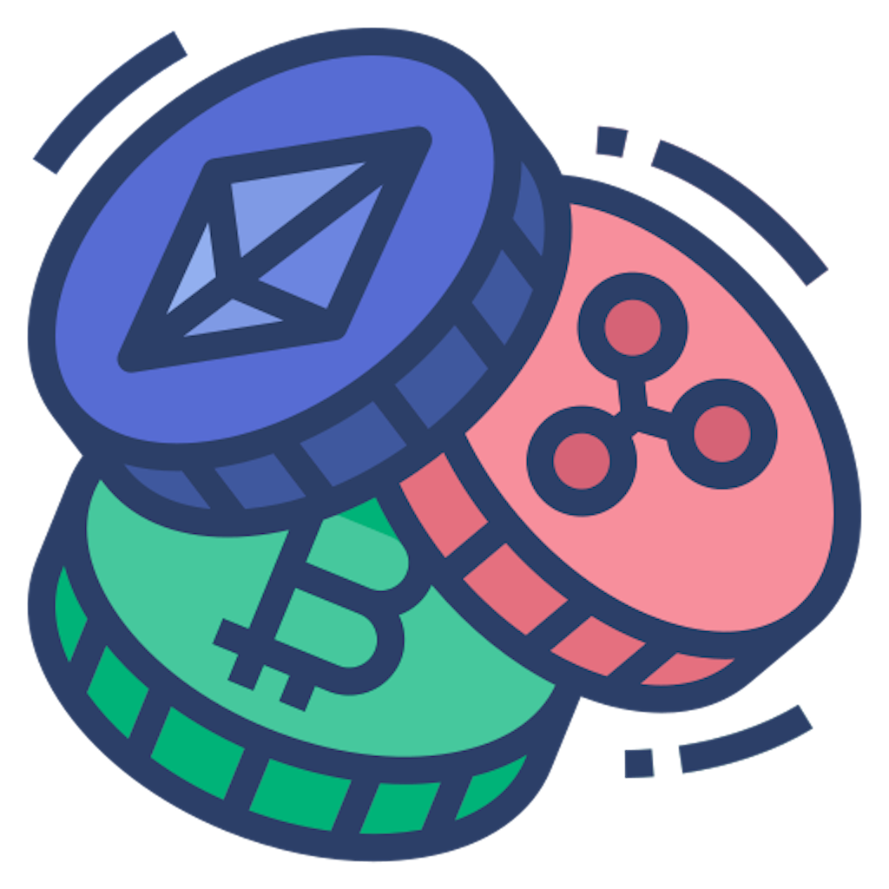
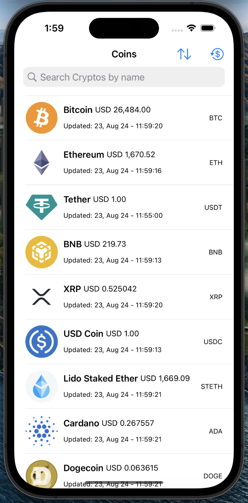
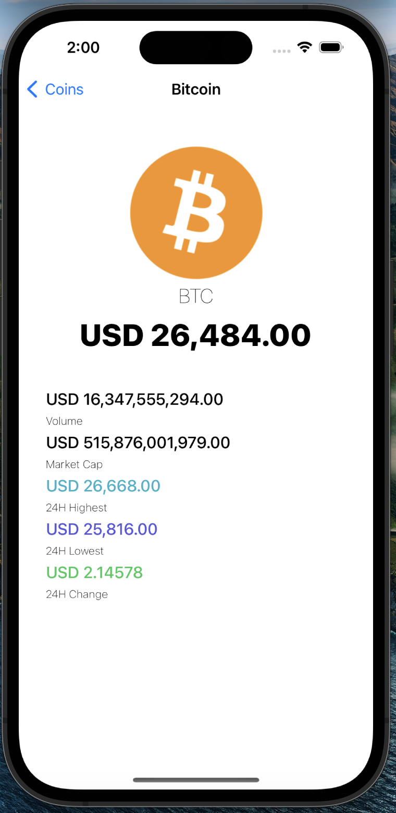

<a name="readme-top"></a>

<!-- PROJECT SHIELDS -->
[![MIT License][license-shield]][license-url]
[![LinkedIn][linkedin-shield]][linkedin-url]


<!-- PROJECT LOGO -->
<br />
<div align="center">
  <a href="https://github.com/nockzblack/CriptoWatchApp">
    
  </a>

<h3 align="center">CriptoWatchApp</h3>

  <p align="center">
    The app allows users to get the latest data about cryptos coins. This includes current price, market cap, total volume, symbol, among other data. All display data comes from <a href="https://www.coingecko.com/en/api">Gecko API</a> 
    <br />
    <a href="https://github.com/nockzblack/CriptoWatchApp"><strong>Explore the docs »</strong></a>
    <br />
    <br />
    <a href="https://github.com/nockzblack/CriptoWatchApp">View Demo</a>
    ·
    <a href="https://github.com/nockzblack/CriptoWatchApp/issues">Report Bug</a>
    ·
    <a href="https://github.com/nockzblack/CriptoWatchApp/issues">Request Feature</a>
  </p>
</div>


<!-- TABLE OF CONTENTS -->
<details>
  <summary>Table of Contents</summary>
  <ol>
    <li>
      <a href="#about-the-project">About The Project</a>
      <ul>
        <li><a href="#built-with">Built With</a></li>
      </ul>
    </li>
    <li>
      <a href="#getting-started">Getting Started</a>
      <ul>
        <li><a href="#prerequisites">Prerequisites</a></li>
        <li><a href="#installation">Installation</a></li>
      </ul>
    </li>
    <li><a href="#roadmap">Roadmap</a></li>
    <li><a href="#contributing">Contributing</a></li>
    <li><a href="#license">License</a></li>
    <li><a href="#contact">Contact</a></li>
    <li><a href="#acknowledgments">Acknowledgments</a></li>
  </ol>
</details>


<!-- ABOUT THE PROJECT -->
## About The Project
<br>
<div align="center">
  
  
</div>


<p align="right">(<a href="#readme-top">back to top</a>)</p>


### Built With

* [![Swift][Swift]][Swift-url]
* [![Xcode][Xcode]][Xcode-url]

<p align="right">(<a href="#readme-top">back to top</a>)</p>


<!-- GETTING STARTED -->
## Getting Started

This is an example of how you may give instructions on setting up your project locally.
To get a local copy up and running follow these simple example steps.


### Prerequisites

You need to have Xcode install to and setup a developer account in order to try it in your own device.


### Installation

1. Clone the repo
   ```sh
   git clone https://github.com/nockzblack/CriptoWatchApp.git
   ```

2. Run the project using Xcode

<p align="right">(<a href="#readme-top">back to top</a>)</p>


<!-- ROADMAP -->
## Roadmap

- [X] Consume Gecko API
- [X] Show list of cryptos
- [X] Feature sort by name, market cap, price
- [X] Fetch cryptos with fiat currencies
- [X] Search critpos title
- [X] Unit testing

See the [open issues](https://github.com/nockzblack/CriptoWatchApp/issues) for a full list of proposed features (and known issues).

<p align="right">(<a href="#readme-top">back to top</a>)</p>


<!-- CONTRIBUTING -->
## Contributing

Contributions are what make the open source community such an amazing place to learn, inspire, and create. Any contributions you make are **greatly appreciated**.

If you have a suggestion that would make this better, please fork the repo and create a pull request. You can also simply open an issue with the tag "enhancement".
Don't forget to give the project a star! Thanks again!

1. Fork the Project
2. Create your Feature Branch (`git checkout -b feature/AmazingFeature`)
3. Commit your Changes (`git commit -m 'Add some AmazingFeature'`)
4. Push to the Branch (`git push origin feature/AmazingFeature`)
5. Open a Pull Request

<p align="right">(<a href="#readme-top">back to top</a>)</p>


<!-- LICENSE -->
## License

Distributed under the MIT License. See `LICENSE.txt` for more information.

<p align="right">(<a href="#readme-top">back to top</a>)</p>


<!-- CONTACT -->
## Contact

Project Link: [https://github.com/nockzblack/CriptoWatchApp](https://github.com/nockzblack/CriptoWatchApp)

<p align="right">(<a href="#readme-top">back to top</a>)</p>


<!-- ACKNOWLEDGMENTS -->
## Acknowledgments

* [Choose an Open Source License](https://choosealicense.com)
* [Img Shields](https://shields.io)
* [Cocoacast](https://cocoacasts.com/)
* [App Icon](www.freepik.com)

<p align="right">(<a href="#readme-top">back to top</a>)</p>


<!-- MARKDOWN LINKS & IMAGES -->
[license-shield]: https://img.shields.io/github/license/othneildrew/Best-README-Template.svg?style=for-the-badge
[license-url]: https://github.com/nockzblack/CriptoWatchApp/blob/main/LICENSE.txt
[linkedin-shield]: https://img.shields.io/badge/-LinkedIn-black.svg?style=for-the-badge&logo=linkedin&colorB=555
[linkedin-url]: https://linkedin.com/in/https://www.linkedin.com/in/ferbenavides/
[home-screenshot]: images/home_ss.png
[details-screenshot]: images/details_ss.png
[Swift]: https://img.shields.io/badge/swift-000000?style=for-the-badge&logo=swift
[Swift-url]: https://developer.apple.com/swift/

[Xcode]: https://img.shields.io/badge/xcode-000000?style=for-the-badge&logo=xcode

[Xcode-url]: https://developer.apple.com/xcode/
